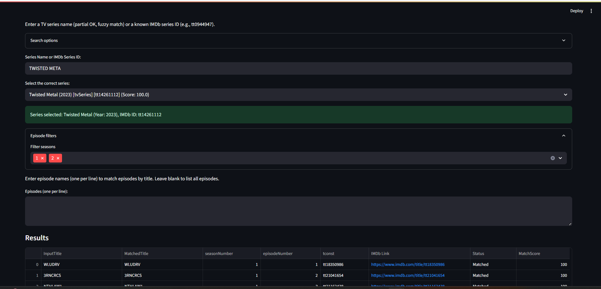

# 🎬 IMDb Title ID Fetcher

A lightweight Streamlit app to fetch **IMDb Title IDs**, **season numbers**, and **episode numbers** for any web/TV series using IMDb datasets.

## 🔍 Features

- Search any TV/web series title from IMDb
- Paste episode names (or leave blank to get all episodes)
- Uses fuzzy matching for close title matches
- Outputs: **IMDb ID (tconst)**, **season number**, **episode number**, **matched episode title**
- Preserves your input title even when no match is found
- Download clean results as CSV

## 🖥 How to Use

1. Enter the series name
2. Paste episode names (one per line) or leave it blank
3. See fuzzy matches + download CSV

## 📦 Requirements

Install dependencies with:

```bash
pip install -r requirements.txt
```

## 🚀 Run the App

```bash
streamlit run imdb_epi_matcher.py
```

## 📁 IMDb Data Files Required

To run this app, you need two IMDb data files:

- [`title.basics.tsv.gz`](https://datasets.imdbws.com/title.basics.tsv.gz)
- [`title.episode.tsv.gz`](https://datasets.imdbws.com/title.episode.tsv.gz)

👉 You can download them directly from the official [IMDb Datasets Page](https://datasets.imdbws.com/)

After downloading:
1. **Unzip** both `.gz` files (you’ll get `.tsv` files)
2. Place the extracted `title.basics.tsv` and `title.episode.tsv` files in your project folder

> ℹ️ These datasets are free for non-commercial use and are regularly updated by IMDb.  
> Full documentation: [IMDb Non-Commercial Datasets](https://www.imdb.com/interfaces/)

## 📸 Screenshot



## 📤 Deploy

### Option 1: Locally

```bash
streamlit run imdb_epi_matcher.py
```

### Option 2: Streamlit Cloud (Free)

1. Push this repo to GitHub
2. Go to [share.streamlit.io](https://share.streamlit.io)
3. Connect your GitHub → Select this repo
4. Set the app file to `imdb_epi_matcher.py`
